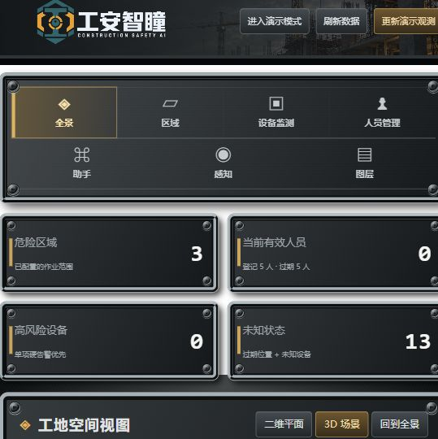
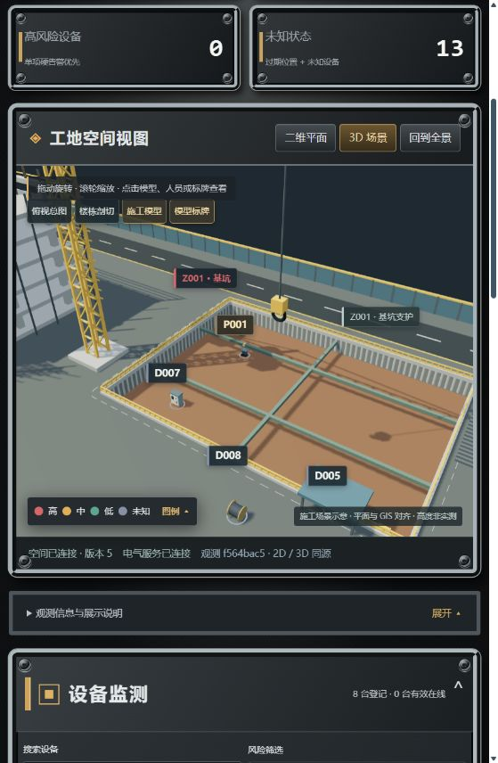

# 工地建模升级（V6，2026-10-06）

项目新增与 GIS 平面坐标对齐的施工模型，运行 `run_demo.py` 后打开 `http://127.0.0.1:8080/`，选择“3D 场景”查看。

## 效果图





## 场景内容

- Z001 基坑：按 GIS 多边形在场地上开挖，加入坑底、排桩、冠梁、内支撑、坑边栏杆与爬梯。模型示意深度为 10 米。
- A 栋：六层柱梁楼板、外脚手架、安全网、顶部钢筋与施工升降机。
- 塔吊：格构塔身、三角桁架起重臂、回转平台、操作室、配重和吊钩。
- Z002 吊装区：地面划线、隔离设施与预制构件。P002 保留之前指定的偏离中心位置。
- Z003：分层钢结构平台、护栏和爬梯。
- 其他场内设施：双层临建办公房、管材和模板堆场、自卸车、履带挖掘机、围挡、出入口、门岗、道路标线、人行横道、照明杆、消防点与绿化。
- 人员、配电设备和电缆卷盘采用细化模型，状态颜色来自原有接口。

## 操作

选择“3D 场景”。拖动旋转，滚轮缩放，右键平移。点击模型或标牌查看构件说明；人员和设备依然可以从管理表中定位。

- “俯视总图”：从上方查看场地布局。
- “楼栋剖切”：切除 A 栋和 Z003 平台的示意高度 28 米以上部分，显示内部结构。再次点击恢复。
- “施工模型”：隐藏或恢复实体模型，便于查看业务图层。
- “模型标牌”：隐藏或恢复施工构件名称；人员、设备和风险区域标签独立保留。
- “回到全景”：恢复默认三维视角。

标签采用屏幕空间避让；拥挤时优先展示选中对象、人员和设备，隐藏放不下的较低优先级标签。隐藏标签对应的对象仍可在图中或管理表点选。

## 数据与实现

区域平面范围以及人员、设备经纬度沿用原有 GIS 数据。此次不修改风险判定、定位记录、接口端口或路径算法。基坑内对象贴合示意坑底；人员高度和构件竖向尺寸是方便观察的设计示意，不是实测 BIM。

模型完全在本机用已有 Three.js 生成，无需下载第三方模型、纹理或新增运行依赖。重复柱、梁、栏杆、排桩等通过 InstancedMesh 合并绘制；静态场景只在区域数据发生变化时重建。剖切材质与其他场景材质隔离。

入口为 `frontend/construction-scene.js`，构件生成位于 `frontend/construction-model.js`，空间和标签规则位于 `frontend/scene-layout.mjs`。旧的 `scene3d.js` 和 `site-landscape.js` 保留作为此前版本代码，当前页面已切换到新入口。

## 搜索与参考

此次参考公开项目的场景组织、交互和渲染方法，自行编写模型几何；未复制或导入其代码、资产。

1. [Tarun Construction：Three.js 施工场景示例](https://github.com/Sg-2003/Tarun_Construction)，包含建筑、塔吊、挖掘机等施工场景内容。
2. [That Open Components](https://github.com/ThatOpen/engine_components)，浏览器 BIM 组件体系。
3. [That Open 剖切教程](https://github.com/ThatOpen/engine_docs/blob/main/docs/Tutorials/Components/Core/Clipper.mdx)，用于理解模型内部检查交互。
4. [Three.js InstancedMesh 文档](https://threejs.org/docs/pages/InstancedMesh.html)，重复构件批量绘制。
5. [Three.js WebGLRenderer 文档](https://threejs.org/docs/pages/WebGLRenderer.html)，裁剪、阴影与渲染配置。

现有仓库未提供真实工地 IFC/BIM 文件；本次完善的是与演示 GIS 对齐的施工示意模型。

## 验证

Python 后端测试共 49 项、Node 前端测试共 10 项通过。前端测试覆盖原有数据同步与新增基坑开口、GIS 坐标一致性、标签避让、重复构件合并及剖切材质隔离。浏览器验证模型点选、俯视、剖切、隐藏模型、标牌开关、二维/三维切换及数据刷新，无控制台错误。

```powershell
.venv/Scripts/python -m pytest -q
node --test tests/frontend.test.cjs tests/motion.test.cjs tests/scene-model.test.cjs
```
