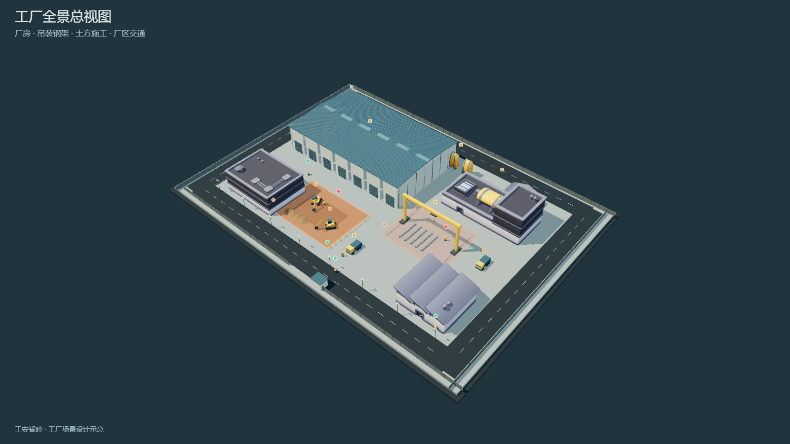
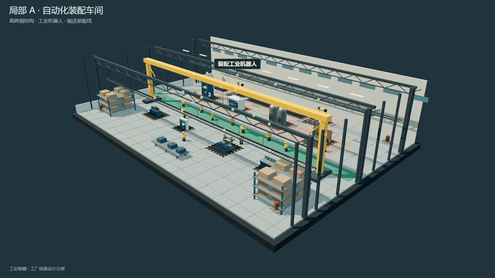
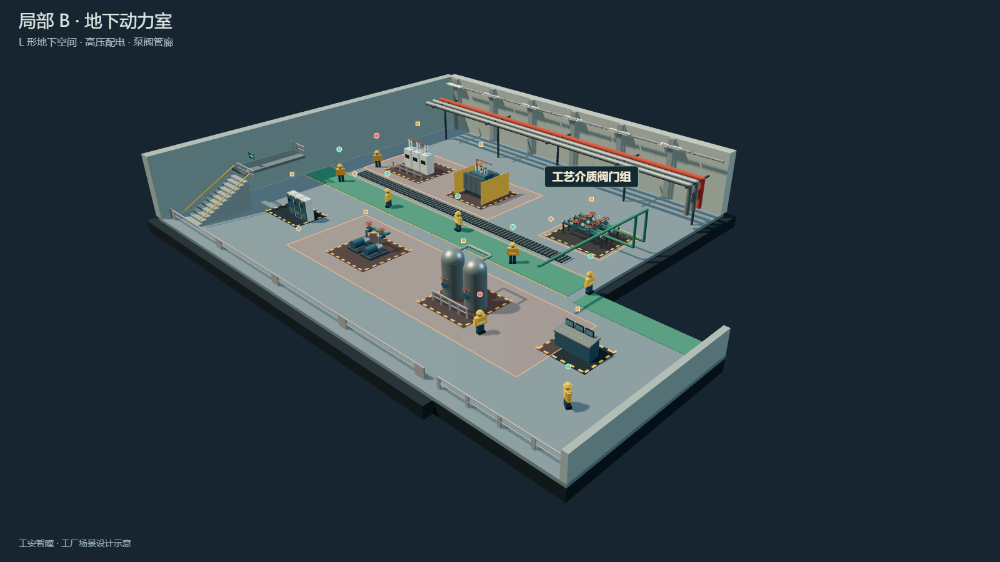

> 最新界面与数据链路：数字孪生为首页，沿用原版机械金属面板和 logo；首页与 GIS 共用后台观测。实时数据、来源标记和现场接入方式见 [factory-realtime.md](factory-realtime.md)。

> 2026-10-07 更新：当前首页提供统一厂区外观、整体剖面与 A/B 两个巡检工区。以下截图及尺寸记录的是旧版设计；当前厂房轮廓、B 区侧翼与操作说明见 [V8 视图说明](factory-clear-views.md)。

# 工厂工地三维可视化：场景设计与交互方案

本地首页：[工厂安全首页](http://127.0.0.1:8080/)。全景、局部 A、局部 B 直接显示在首页顶部，取代原“工地空间视图”。设备监测、人员管理、危险区域台账位于同一首页下方。原 GIS 工作台保留在 `workbench.html`。本轮仅修改本地文件，未提交或推送 GitHub。

交付包括一张园区全景、两张不同工区局部图，以及可以直接运行的 Three.js 前端。配图统一为 1600×900 PNG，由实际三维场景渲染。当前采用统一工业材质和简化设备构造，属于工程可视化设计稿，尚未达到照片级资产与实测 BIM 的精度。

## 1. 统一场景风格

以混凝土灰、工业钢蓝和金属灰构成主要材质；安全黄用于吊架、机械、防护边界与小标识。工区巡检通道采用低饱和绿色。三套场景共享灯光、色调映射和阴影设置，采用可旋转的斜向鸟瞰视角。全景默认俯角约 45°；局部采用建筑剖开视图，移除顶部和近侧围护，便于查看设备。

全景配置 6 位编号人员、6 个设备对象；局部 A 配置 12 位不同岗位人员与 12 个设备对象，局部 B 配置 8 位人员与 12 个设备对象。场景共有 26 位人员、30 个设备对象和 12 个危险区域。位置来自本地模拟；进入报警由位置与区域边界实际计算，传感器观测仍待接入。

## 2. 第一张：工厂全景总视图



厂区基底约 164×118 米，沿外围布置环形道路和围栏，入口连接车辆通道。主体装配厂房位于中后部，辅助工业建筑分布在两侧。吊装钢架和钢材堆放区位于中央偏右；土方施工区与两台履带挖掘机位于左前侧；运输工程车沿施工区和设备区安排。中央作业面与道路保留分隔，避免车辆穿过建筑或危险设备。

主画面以厂房、建筑屋顶、吊装钢架和大型机械为重点。总览的 E-01 / E-02 为挖掘机，E-03 / E-04 为工程运输车，E-05 为龙门起重机，E-06 为储罐组；P021～P026 包含门岗、施工工人、吊装工、电工及司机。全景显示两个工区入口小标识与 Z001 / Z002 危险区域边界；点击 A / B 图标进入对应内部工区，或使用上方视图按钮直接切换。

## 3. 第二张：局部 A——装配制造工区



A 区为约 70×46 米、14 米高的自动化装配车间，以钢柱、屋架桁架和桥式起重机形成高跨空间。机械加工、储气焊接与前排辅助设备沿中央通行带布置，后侧新增两台工业机器人和滚筒输送装配线，前侧设置物料货架及包装工作台。12 位编号人物分为安全员、机械操作工、电工、装配工、焊工、维修工等角色。

| 编码 | 设备中文名称 | 设计巡检关注点 |
|---|---|---|
| A-01 | 液压冲压机 | 运动夹点、液压压力、防护联锁 |
| A-02 | 数控加工中心 | 旋转主轴、防护门、切屑飞溅 |
| A-03 | 压缩空气储气罐 | 容器压力、泄压阀、管线连接 |
| A-04 | 气瓶焊接工作站 | 气瓶固定、软管、动火隔离 |
| A-05 | 空气压缩机组 | 高温表面、传动机构、泄漏 |
| A-06 | 车间低压配电箱 | 箱门、接地、支路保护 |
| A-07 | 双联循环水泵组 | 联轴器防护、振动、积水 |
| A-08 | 生产线操作台 | 急停、控制按钮、操作权限 |
| A-09 | 车间桥式起重机 | 吊具、行程限位、吊运隔离 |
| A-10 | 装配工业机器人 | 机械臂运动范围、防护联锁 |
| A-11 | 搬运工业机器人 | 运动范围、夹具防护 |
| A-12 | 滚筒输送装配线 | 输送夹点、急停、光电保护 |

设备周边以黄黑边界示意作业范围。输送管线与桥架走上方和侧边，避开中央通道；起重设施的支腿位于设备区边缘。

## 4. 第三张：局部 B——地下动力工区



B 区按东侧厂房外部轮廓反算主厅及控制侧翼，不再使用独立矩形底板。7.2 米混凝土围护、上部红色主管、侧墙管廊、格栅电缆沟、地下楼梯与低围护取代 A 区的高跨钢梁和吊架。后排设置高压开关柜、变压器与仪表阀门组；前侧设置 PLC 控制柜、排水泵和稳压装置，侧翼设置动力操作台、UPS 电源与电池柜。主厅补充板式换热、柴油发电、双机压缩和软化水处理成套机组；详细设备带与资产来源见 [V9 重建说明](factory-power-v9.md)。8 位编号人物包含电工、管道工、设备维修工、泵房操作工、安全员等角色。

| 编码 | 设备中文名称 | 设计巡检关注点 |
|---|---|---|
| B-01 | 10kV 高压开关柜 | 带电间隔、联锁、绝缘隔离 |
| B-02 | 油浸式变压器 | 散热、油位、围栏完整性 |
| B-03 | 工艺介质阀门组 | 阀位标识、法兰密封、仪表 |
| B-04 | 仪表与 PLC 控制柜 | 柜内供电、报警、线缆标识 |
| B-05 | 地下排水泵组 | 泵体振动、止回阀、积水 |
| B-06 | 压力稳压装置 | 容器压力、泄压、管路支撑 |
| B-07 | 动力监控操作台 | 急停、报警响应 |

场景管线用于表达空间关系，未建立实际工艺流向或供电拓扑。真正用于运行巡检时，需要接入现场设备台账、P&ID 图与供配电资料。

## 5. 可直接用于前端的悬浮交互

### 数据绑定

每个危险设备 Group 都保留独立的设备信息和三维锚点；模型与台账通过 `id` 关联。示例：

```js
{
  id: 'B-03',
  kind: 'device',
  title: '工艺介质阀门组',
  text: '巡检关注：阀位标识、法兰密封与仪表 · 场景设计示意',
  anchor: [9, 3.1, -9],
  zone: 'B',
  view: 'b'
}
```

### 显示行为

1. 常态显示约 7 像素的小方块，鼠标命中区域保持 22×22 像素。
2. 三维锚点每帧通过 `Vector3.project(camera)` 投影到屏幕，标识跟随相机旋转和缩放。
3. `pointerenter` 显示图标上方的编码及中文名称，同时更新右下角详情卡。悬停不会切换镜头。
4. `pointerleave` 隐藏名称提示；若已有点击保留的详情，则恢复该详情。
5. 点击标识、设备本体或设备目录，可保留详情；右下角关闭按钮清空详情。全景 A / B 图标点击则进入对应工区。
6. Tab 键聚焦标识时同样显示名称和详情；Escape 可关闭悬浮提示。触屏通过点击查看详情。
7. 对相邻图标进行屏幕空间避让；视锥外标识隐藏；提示框限制在场景区域内，避免超出窗口。

`scene-markers.mjs` 复用同一编码的按钮节点，数据更新时不会重建正在悬停的标识。弹窗名称通过 `textContent` 写入，避免将设备名称解析成 HTML。

当前图标避让依据屏幕重叠与视锥判断，尚未进行深度遮挡检测。后续增加封闭厂房漫游时，可先用 Raycaster 检查相机到锚点之间是否被墙体遮挡，避免墙后图标透出。

### 前端文件

- `index.html`：首页三视图及下方设备、人员、危险区域台账。
- `factory-home.mjs` / `factory-home.css`：首页台账、搜索筛选、报警卡片和左侧界面。
- `factory-panels.mjs`：左侧功能板块、拖动调宽、键盘调节、模块折叠和图层控制。
- `factory-safety.mjs`：空间进入判断、报警生命周期与移动演示路径。
- `workbench.html`：保留原 GIS 工作台及原业务功能。
- `factory.html`：单独的三视图演示入口、设备目录、详情卡与配图预览。
- `factory-app.mjs`：模型加载、视图切换、镜头适配、投影和导出。
- `factory-model.mjs`：园区布局与 A / B 工区模型、中文设备台账。
- `scene-markers.mjs`：悬停、键盘、点击及标识节点复用。
- `factory.css`：数字孪生看板布局与窄窗口适配。
- `assets/factory/manifest.json`：源地址、作者、许可、固定提交版本与 SHA-256。

Three.js、GLTFLoader 和 OrbitControls 均在本地提供。开源模型共约 0.77 MB，含共享贴图与许可文件；切换工区使用缓存，重复构件以 InstancedMesh 合并。页面上“导出当前视图 PNG”可生成 1600×900 配图预览，并提供保存链接。

## 6. 已使用的 GitHub 开源资产

| 资产 | 作者与来源 | 本次用途 |
|---|---|---|
| building-a / building-k / building-r | Kenney City Kit Industrial，经 [CityCrafter3D GitHub 仓库](https://github.com/immaculate-lift-studio/CityCrafter3D) 提供 | 园区辅助工业厂房 |
| detail-tank | 同上 | 全景储罐 |
| SM_Pipe_2m | [ModKit GitHub 仓库](https://github.com/JaronKBragg7337/asset-pack-ue-threejs-blender-unity) | B 区壁侧管线 |
| SM_Barrel / SM_Pallet | 同上 | A 区边角物料设施 |
| SM_Railing_4m | 同上 | 装置边界与巡检防护 |

上述模型的许可文件均已保存为 CC0-1.0。[Kenney 官方资产页面](https://kenney.nl/assets/city-kit-industrial)和 [ModKit 许可文件](https://github.com/JaronKBragg7337/asset-pack-ue-threejs-blender-unity/blob/main/LICENSE)提供来源说明。厂房几何比例和部分材质已根据统一工业风重新适配。贴图与模型的依赖文件也已一并保存。

本次对开源资源进行了优先检索；主厂房、道路围栏、土方区、挖掘机、运输车、人物及具体危险设备采用补充程序化建模，以保证布局、中文名称和巡检语义对应。它们并非全部来自第三方模型库。另参考了 [threejs-factory-demo](https://github.com/wenxingjun/threejs-factory-demo) 的工业数字孪生交互组织方式，未复制其场景源代码。

## 7. 左侧板块与区域进入报警

左侧延续首版的 CONTROL 导航，提供全景、设备监测、人员管理、危险区域、报警中心与图层调节。板块可展开 / 收起，拖动右边界调整 270～480 px 宽度；分隔条可通过左右方向键调节。场景高度在 440～760 px 之间调整，尺寸保存在本地浏览器。首页下方台账也可折叠，同一模块移动到左侧面板时不复制数据。

三维模型与表格共用同一份对象：30 个设备对象、26 位多岗位人员、12 个危险区域。小方块是设备，小圆点是人员，小菱形是区域。人员 / 车辆进入限制范围后点位变红，详情展示人员编码、工种、场景位置及危险区编码；报警中心提供定位和进入 / 离开记录。

| 区域 | 名称 | 视图 | 关联设备 |
|---|---|---|---|
| Z001 | 土方施工区 | 全景 | E-01、E-02 挖掘机作业范围 |
| Z002 | 吊装作业区 | 全景 | E-05 龙门吊作业范围 |
| Z003 | 冲压加工危险区 | A | A-01、A-02 |
| Z004 | 储气焊接危险区 | A | A-03、A-04 |
| Z005 | 高压隔离区 | B | B-01、B-02 |
| Z006 | 阀门操作区 | B | B-03 |
| Z007 | 泵组压力区 | B | B-05、B-06 |
| Z008 | 机器人自动运行区 | A | A-10、A-11、A-12 |

判断仅在同一视图内使用矩形范围和实体的平面位置。固定设备位于自身作业区不触发进入报警；挖掘机 E-01 / E-02 授权在 Z001 作业，其他车辆进入限制范围报警。初始演示布置 6 条人员进入报警，展示的是模拟位置的空间状态。界面未生成温度、压力、负荷等虚假传感器读数。

进入时产生一次记录，在区域内持续停留不会每帧重复新增。离开时解除当前报警并保留离开记录；最多保留 40 条记录。未知位置不能当作安全，也不会伪造离开事件。隐藏人员 / 区域图层不关闭空间判断，定位隐藏对象会自动重新显示对应图层。

场景下方的“区域进入演示”可选择总览工人 P023、工程车 E-04、A 区装配工 P005 或 B 区电工 P016。点击开始后，人物或车辆沿通道进入限制区再离开；停止会保留当前位置，恢复初始位置会重新判定报警。

前端已提供同一视图内的位置更新入口，供后续定位适配器调用：

```js
window.FactoryTwin.updatePosition('P023', { x: -28, z: 19 });
// 更新模型与标记，并自动重新计算报警。
```

当前坐标为工区局部设计坐标，未直接复用原 GIS 经纬度。接入真实定位需要先完成坐标映射、时间有效性和人员权限配置。原 GIS 功能保留在 workbench.html，原后台观测未被修改。

## 8. 验证与使用范围

已检查三个视图切换、A / B 中文名称提示、详情保留及图片预览。20 项自动检查通过，覆盖首页设备筛选与台账定位、人员模型绑定、危险区与关联设备位置关系、设备编码唯一性、危险设备与图标对应、不同工区设备间距、进入与离开的报警生命周期、车辆授权规则、未知位置和四条演示路径、开源资产哈希、共享贴图依赖，以及原工作台的标识与数据行为。

这套场景可以直接用于前端演示和巡检交互原型；设备尺寸、位置与人物均为设计台账，不代表现场实测或真实运行状态。若目标是照片级厂区数字孪生，需要进一步引入现场 CAD / BIM 和高细节 PBR 设备资产。
