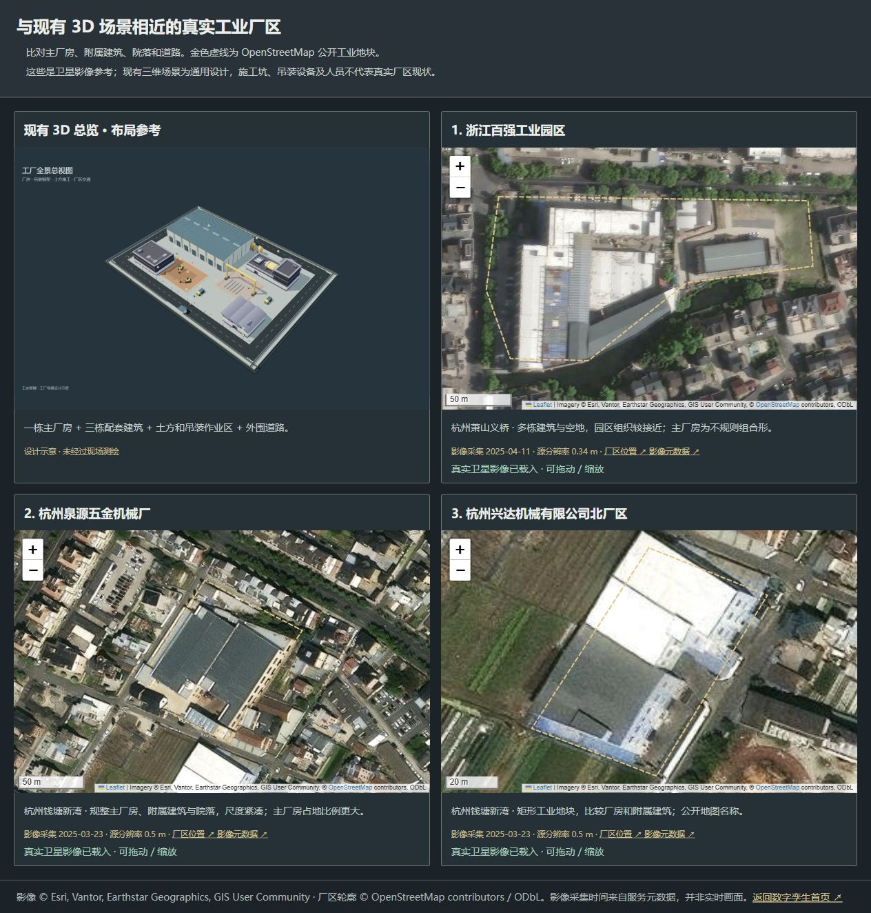

# 与现有工厂 3D 总览接近的真实厂区

已按现有模型的主厂房、配套建筑、院落和道路组织比对三处公开工业地块。推荐杭州泉源五金机械厂作为后续布局参考；这是视觉相似度判断，并非测绘配准结果。

[打开可拖动缩放的并排对比页](http://127.0.0.1:8080/map-reference.html)

GIS 工作台采用泉源厂区作为外部参考；公开边界、近似建筑轮廓和道路由 `frontend/assets/factory/reference-site.geojson` 提供。建筑平面与遥感参考三维外观共用该文件，模型高度为假设。用于近似描绘的[原始影像核对截图](images/reference-site.png)已保留，供复核来源与大致对应关系。

|候选|WGS84 中心，经度 / 纬度|影像采集日期|服务标注源分辨率|匹配特点与差异|
|---|---|---|---|---|
|杭州泉源五金机械厂|120.5357516 / 30.2798940|2025-03-23|0.50 m|独立主厂房、配套建筑、院落，组合较接近；主厂房占地比例更大，整体方向不同。|
|浙江百强工业园区|120.2066189 / 30.07866805|2025-04-11|0.34 m|工业地块内有多组建筑和空地；主厂房为不规则组合形，与模型矩形主厂房不同。|
|杭州兴达机械有限公司北厂区|120.53559735 / 30.27890725|2025-03-23|0.50 m|矩形地块与工业屋面；建筑占地较满，缺少模型里的宽阔作业院落。|

名称和范围来自 OpenStreetMap，属于公开地图记录；不作为当前经营主体或精确用地权属证明。影像采集日期和源分辨率来自 Esri World Imagery 对该中心点的元数据，核对日期为 2026-10-06。分辨率不是定位精度，也不表示整个厂区所有瓦片均由同一日期采集。

## 对应边界

这些厂区能作为真实卫星底图与外观参考。现有 3D 场景并不是它们的真实孪生模型；基坑、吊架、设备、人员、A/B 内部工区及危险区域都属于设计演示。不能把演示报警说成这些企业的实际监控结果。对比页已显示这一区别。参考页、公开影像元数据与来源说明随本版本一起发布。

## 来源

- [泉源厂区公开地块](https://www.openstreetmap.org/way/1201137102)
- [百强园区公开地块](https://www.openstreetmap.org/way/1098282575)
- [兴达北厂区公开地块](https://www.openstreetmap.org/way/1201137101)
- [泉源位置的影像元数据](https://services.arcgisonline.com/ArcGIS/rest/services/World_Imagery/MapServer/11/query?geometry=120.5357516%2C30.279894&geometryType=esriGeometryPoint&inSR=4326&outFields=%2A&returnGeometry=false&f=json)
- [百强位置的影像元数据](https://services.arcgisonline.com/ArcGIS/rest/services/World_Imagery/MapServer/11/query?geometry=120.2066189%2C30.07866805&geometryType=esriGeometryPoint&inSR=4326&outFields=%2A&returnGeometry=false&f=json)
- [兴达位置的影像元数据](https://services.arcgisonline.com/ArcGIS/rest/services/World_Imagery/MapServer/11/query?geometry=120.53559735%2C30.27890725&geometryType=esriGeometryPoint&inSR=4326&outFields=%2A&returnGeometry=false&f=json)

影像由页面按需请求官方服务，保留 Esri / Vantor / Earthstar Geographics / GIS User Community 署名；公开地块轮廓保留 OpenStreetMap contributors / ODbL 署名。未进行瓦片批量抓取或离线影像打包。
